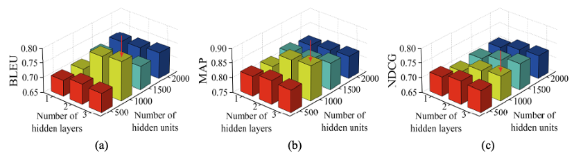
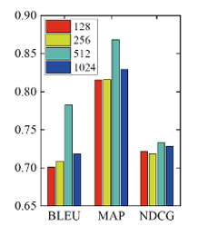

# DDASR
This is the code reproduce repository for the paper [DDASR: Deep Diverse API Sequence Recommendation]
## Dependency
* python==3.8.0
* pytorch==1.10.2+cu113
* numpy==1.22.2

## File Structure
* Seq2Seq.py: the Seq2Seq model
* Encoder.py: query Encoder
* Decoder.py: API Sequence Decoder
* Evaluate.py: eval the model
* LossLongtail.py: loss function
* data_loader.py: data loader
* Metrics.py: evaluation metrics
* main.py: you can run this file to train the model
## Dataset
* For the original Java dataset, you can download from [https://github.com/huxd/deepAPI].
* For the Python dataset, you can download from [https://github.com/hapsby/deepAPIRevisited].
* For the diverse Java dataset, since the dataset is quite large, I have to upload it using Google Drive. Please download the full package using the following link:
[https://drive.google.com/drive/folders/16c2ZbXr2N2Q_v8fjvLBdUWh2pVQQZhng?usp=sharing]

## Architectures
### RNN encoder-decoder
* BiLSTM is used as the encoder and GRU is used as the decoder.
* For our DDASR, we select the best hyper-parameter settings when evaluating the RNN encoder-decoder architecture. 
* Figure 1 shows the effect of varying the number of hidden units and the number of hidden layers on the accuracy of DDASR with RNN encoder-decoder architecture on the original dataset when the dimension of word embedding is 512. BLEU, MAP, and NDCG achieve the best effect, which is 78.25%, 86.83%, and 73.81%, respectively, when the number of hidden layers is three and the number of hidden units is 1,000.

* Figure 2 shows the effect of the dimension of word embedding on the accuracy of DDASR with RNN encoder-decoder architecture on the original dataset when the number of hidden units is 1,000, and the number of hidden layers is 3. When the dimension of word embedding is 512, BLUE, MAP, and NDCG all achieve the best results, which are 78.25%, 86.83%, and 73.31%, respectively. Therefore, for the RNN encoder-decoder, we set the number of hidden layers, the number of hidden units, and the dimension of word embedding to 3, 1,000, and 512, respectively.

### Transformer encoder-decoder
* Transformer with six layers is used as the encoder end the decoder.
* For Transformer encoder-decoder architecture, we use the same parameter of word embedding dimensions as the RNN encoder-decoder architecture.
### LLM encoder-decoder
We utilize five recent LLMs as the encoder and Tansformer with six layers as the decoder.
* CodeBERT: microsoft/codebert-base [https://huggingface.co/microsoft/codebert-base]
* GraphCodeBERT: microsoft/graphcodebert-base [https://huggingface.co/microsoft/graphcodebert-base]
* PLBART: uclanlp/plbart-base [https://huggingface.co/uclanlp/plbart-base]
* CodeT5: Salesforce/codet5-base [https://huggingface.co/Salesforce/codet5-base]
* UniXcoder: microsoft/unixcoder-base [https://huggingface.co/microsoft/unixcoder-base]
* For the evaluation of the LLM encoder-decoder architecture, we use the predefined hyper-parameters from the openly available models on Hugging Face. The predefined parameters for LLMs are carefully selected and optimized through extensive training to suit the architecture of LLMs. Therefore, we do not keep the parameters consistent between the LLM architecture and other architectures. Instead, we choose the optimal parameters for each architecture to ensure a fair comparison.

## Competing Models
* DeepAPI
the repository of DeepAPI [https://github.com/huxd/deepAPI]
* BIKER
the repository of BIKER [https://github.com/tkdsheep/BIKER-ASE2018]
* CodeBERT
the repository of CodeBERT [https://github.com/hapsby/deepAPIRevisited]
* CodeTrans
the repository of CodeTrans [https://github.com/agemagician/CodeTrans]

